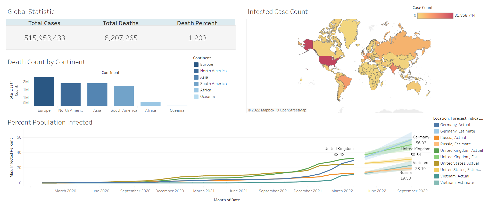

# COVID-19 Analysis

## Dataset
- The dataset is provided on [ourworldindata.org](https://ourworldindata.org/covid-deaths) website. Number of covid cases and vaccination people are updated daily. This dataset was last updated on 2022/05/07.
- Excel is used to separate the data on infections/deaths and vaccination status.

## Data Visualization
[Visual Dashboard](https://public.tableau.com/views/CovidAnalysisDashboard_16529863493910/Dashboard1?:language=en-US&:display_count=n&:origin=viz_share_link)
